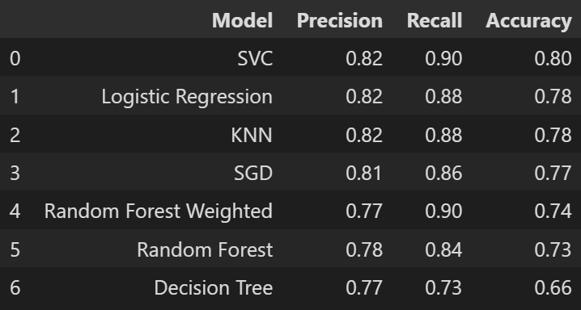

## Rain_Prediction-ML-Project

### Deployed Link : https://rain-prediction-project-dps.onrender.com

### Problem Statement :
`Based on given dataset we need to develop a model which predict weather rainfall will occur or not.`

### Software and Tools Required

1. [Github Account](https://github.com)
2. [VS Code IDE](https://code.visualstudio.com/)
3. [Git CLI](https://git-scm.com/book/en/v2/Getting-Started-The-Command-Line)
4. [Render](https://dashboard.render.com/)

Create a new virtual environment : 
```
python -m venv rainenv
```

Activate this virtual environment :
```
rainenv\Scripts\activate
```

### File/Folder Description :
1. `Templates` : It includes those file which is dynamically changing and used by render_template.
2. `Static` : It includes those file which is static in nature like css, js, images.

#### Dataset Source : https://www.geeksforgeeks.org/rainfall-prediction-using-machine-learning-python/

### Libraries Used 
1. Numpy
2. Pandas
3. Matplotlib
4. Seaborn
5. Imblearn (for oversampling)
6. Scikit Learn (Sklearn)
7. Flask

### Data Preprocessing Steps
1. Dropped two features i.e _mintemp_ and _maxtemp_ due to high correlation.
2. Data is highly unbalanced (i.e 68% in favour of rain) , so balanced it by doing oversampling using _SMOTE_.
3. Scale the inputs using _Standard Scalar_. 

### Models Tried 
1. Logistic Regression
2. Stochastic Gradient Descent(SGD) Classifier
3. KNeighborsClassifier
4. DecisionTreeClassifier
5. RandomForestClassifier
6. Support Vector Classifier(SVC)
7. RandomForestClassifier(Without oversampling, _class_weight='balanced'_)

### Accuracy Table 


### For Home page :
1. HTML (for form creation)
2. CSS (for styling)
